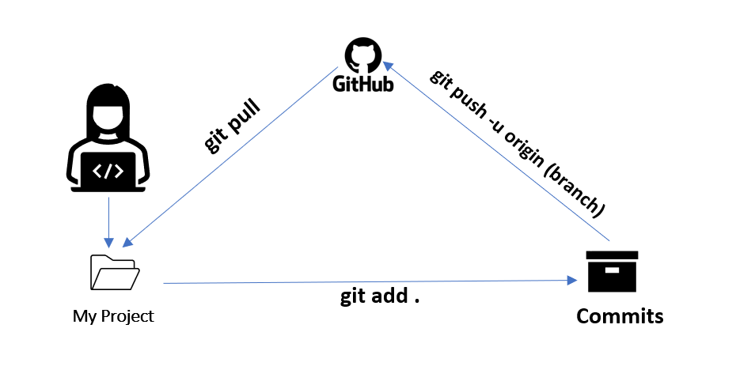

# Git Theory
Theory on Git and GitHub

## 1. What is Version Control?
- ***Version control*** is a system that **tracks changes that we make to files over time**, allowing us to access previous versions of the files and collaborate with others on the same files without overwriting each other's work. 
- It is a system commonly used in software development to manage code changes, but can be applied to any type of file.

## 2. What is Git?
- ***Git*** is a **distributed version control system that allows multiple people to work on the same project without accidentally overwriting each other's work**(everyone has their own local copy of the project`s source code repository; when changes are made locally, they can be pushed to the central repository). 

### Why use Git? 
- It keeps track of changes made to the code and allows you to view previous versions, or "commits", so you can easily undo changes if necessary. 
-  It is a powerful and flexible tool that provides a range of benefits for software developers, making it an essential part of the software development process.

### Benefits of Git:
- **Collaboration**: Git enables multiple developers to work on the same project simultaneously and track changes made by each individual.

- **Version control**: Git provides version control, which means that it keeps track of changes made to the source code over time. 

- **Branching and merging**: Git allows developers to create multiple branches of the source code, which can be worked on independently and then merged back into the main codebase.

- **Backup and recovery**: Since Git stores all versions of the code, it provides a reliable backup system for developers.

- **Open source**: Git is open source, which means that it is freely available to use and modify. This has led to a large community of developers contributing to the development and improvement of Git.

.PNG)

## 3. Why use Git in DevOps?

- ***Git*** is commonly used in DevOps practices because it **provides a powerful set of tools for managing source code**, and it **supports a distributed model of collaboration** that is well-suited for DevOps workflows.

- **Version control**: DevOps teams need to manage many different versions of source code as they move through development, testing, and deployment. Git provides a robust version control system that makes it easy to track changes to the codebase over time, as well as to collaborate and share code changes with other team members.

- **Continuous integration and delivery**: Git is designed to support continuous integration and continuous delivery (CI/CD) workflows. DevOps teams can use Git to trigger automated build and deployment processes whenever new code changes are pushed to the central repository, allowing for fast and frequent releases.

- **Branching and merging**: Git makes it easy to create and manage feature branches, bug fix branches, and other types of branches that are needed in a DevOps workflow. These branches can be easily merged back into the main codebase once they have been reviewed and tested, helping to ensure that the codebase is always up-to-date and stable.

- **Integration with other tools**: Git can be easily integrated with other DevOps tools such as build automation systems, testing frameworks, and deployment automation tools. This makes it possible to create a seamless, end-to-end workflow for software development and delivery.

## 4. What is GiHub?

- ***GitHub** is a **web-based hosting service** that provides a **platform for software developers to collaborate on and manage their code repositories**. It is *built on top of the Git version control system and offers additional features, such as project management tools, issue tracking, and team collaboration*.

### GitHub vs Git:

- Git is a distributed version control system that is used to manage source code, while GitHub is a web-based platform that provides a range of features for managing Git repositories and collaborating on software development projects.

- Git is a command-line tool that can be used locally, while GitHub is a cloud-based service that is accessed through a web browser.

- Git can be used independently or with other web-based hosting services, while GitHub is a proprietary platform that is only available through the GitHub website.

- Git provides basic version control features, such as branching and merging, while GitHub offers additional features such as issue tracking, project management tools, and team collaboration.

- Git is open source and free to use, while GitHub offers a range of pricing plans depending on the number of users, repositories, and features needed.

In summary, Git is a distributed version control system used to manage source code, while GitHub is a web-based platform built on top of Git that provides additional features for managing and collaborating on software development projects.

